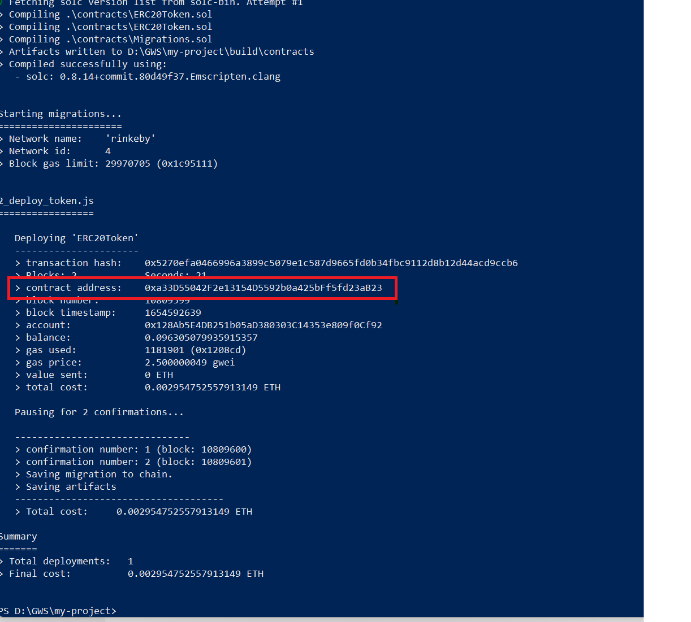

# Table of Content

- [Table of Content](#table-of-content)
  - [What will this guide cover](#what-will-this-guide-cover)
  - [Pre-requisites](#pre-requisites)
  - [Steps](#steps)
  - [Commands to interact with Deployed contract](#commands-to-interact-with-deployed-contract)
  - [Blockchain Explorer](#blockchain-explorer)
  - [Add and Transfer tokens via Metamask wallet](#add-and-transfer-tokens-via-metamask-wallet)

## What will this guide cover
 - This guide will provide instructions to deploy ERC20 token using the standard OpenZeppelin Contracts
 - The token will be deployed to Rinkeby public test network
 - Some of the tools covered are : Truffle, Infura, Metamask

## Pre-requisites  
- Please follow these steps on a laptop or desktop which is connected to the internet. Doesnt work best on mobile. Also do not work within an organization firewall.
- Install below prerequisites 
  - Basic text editor Ex: VSCode, Atom
  - Chrome web browser
  - NodeJS v14+
  - Install [git](https://git-scm.com/book/en/v2/Getting-Started-Installing-Git)
  - Install [Metamask](https://chrome.google.com/webstore/detail/metamask/nkbihfbeogaeaoehlefnkodbefgpgknn?hl=en)
  - Transfer 0.1 testnet ETH from rinkeby faucet https://rinkebyfaucet.com/ to your metamask wallet. 
  - Sign up and create a free account in [Infura](https://infura.io/)

## Steps
- Clone this repository: `git clone https://github.com/ajithkotian/MyToken.git`
- `cd MyToken`
- `npm init -y`
- `npm install`
- `npx truffle init`
  - Above command will prompt below 3 questions. Answer `N`
  - ? Overwrite contracts? : `N`
  - ? Overwrite migrations? : `N`
  - ? Overwrite truffle-config.js? : `N`
- Open the project "MyToken" in VSCode
- Update the `.env` file with the Infura project id and Metamask wallet private key.
  - Blog on how to get "Infura project id" : https://ethereumico.io/knowledge-base/infura-api-key-guide/ (Refer step 1 and 2)  
  - Blog on how to get Metamask Rinkeby testnet account private key : https://metamask.zendesk.com/hc/en-us/articles/360015289632-How-to-export-an-account-s-private-key
- `npx truffle migrate --network rinkeby`
    - Make a note of the contract address as shown below 
    - 

## Commands to interact with Deployed contract 
- `npx truffle console --network rinkeby`
- `token = await ERC20Token.deployed()`
- `await token.name()`
- `await token.symbol()`
- `(await token.totalSupply()).toString()`
- To exit the truffle console : `.exit`
- 

## Blockchain Explorer 
- https://rinkeby.etherscan.io/

## Add and Transfer tokens via Metamask wallet
- Click on Metamask icon at the top right corner of Chrome - under extensions 
- Choose `Rinkeby Test Network`
- Click `Import Tokens`
- Provide the deployed token contract address 
  - `Token Contract address : <CONTRACT_ADDRESS>`
  - `Token Symbol : UBST`
  - Click on `Add Custom Token`